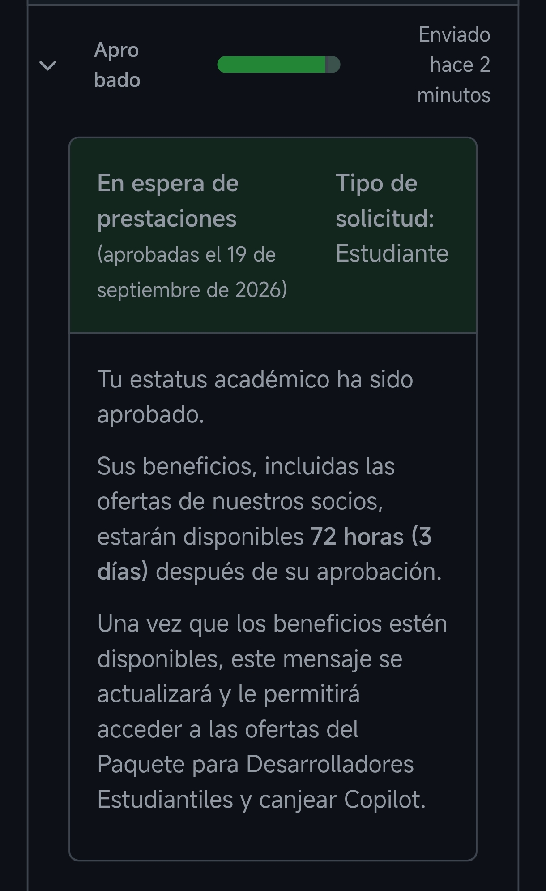

# GitHub Education

## ¿Qué es GitHub Education?

**GitHub Education** es un programa de GitHub dirigido a estudiantes y profesores. Permite acceder a diferentes herramientas y recursos para aprender, desarrollar proyectos y mejorar las habilidades relacionadas con la programación y el desarrollo de software.

Uno de los principales recursos del programa es el **GitHub Student Developer Pack**, que reúne diferentes beneficios y herramientas para estudiantes.

## Beneficios

Entre los beneficios que puede incluir GitHub Education se encuentran:

* **GitHub Pro** mientras se mantenga la condición de estudiante.
* **GitHub Copilot Student** para utilizar herramientas de inteligencia artificial relacionadas con la programación.
* Acceso a recursos de **GitHub Codespaces**.
* **GitHub Pages** para publicar páginas web.
* Diferentes herramientas y servicios ofrecidos por empresas colaboradoras.

Los beneficios disponibles pueden cambiar con el tiempo y algunos pueden requerir una activación adicional.

## Proceso para solicitar GitHub Education

Para solicitar GitHub Education seguí los siguientes pasos:

1. Creé una cuenta de GitHub.
2. Accedí a la página de **GitHub Education**.
3. Inicié el proceso de verificación como estudiante.
4. Proporcioné documentación que demostraba que estaba matriculado como estudiante en el **IES Alan Turing**.
5. Envié la solicitud para que GitHub verificara mi condición de estudiante.
6. Después de realizar la solicitud, GitHub revisó la documentación proporcionada.
7. Finalmente, mi solicitud fue **aprobada**.

## Estado de la solicitud

Actualmente, mi solicitud para **GitHub Education ha sido aprobada**.

Los beneficios asociados a la cuenta pueden tardar hasta **72 horas** en estar disponibles. Por este motivo, en el momento de realizar esta práctica algunos de ellos todavía pueden no aparecer activos.

### Captura de la aprobación

A continuación se muestra la confirmación de que mi solicitud de GitHub Education ha sido aprobada.

## Conclusión

GitHub Education proporciona a los estudiantes acceso a herramientas y recursos que pueden ser útiles para aprender programación y desarrollar proyectos durante sus estudios.

En mi caso, he realizado correctamente el proceso de verificación y mi solicitud ha sido **aceptada**.

## Fuentes consultadas

* GitHub Education
* GitHub Student Developer Pack
* GitHub Docs
