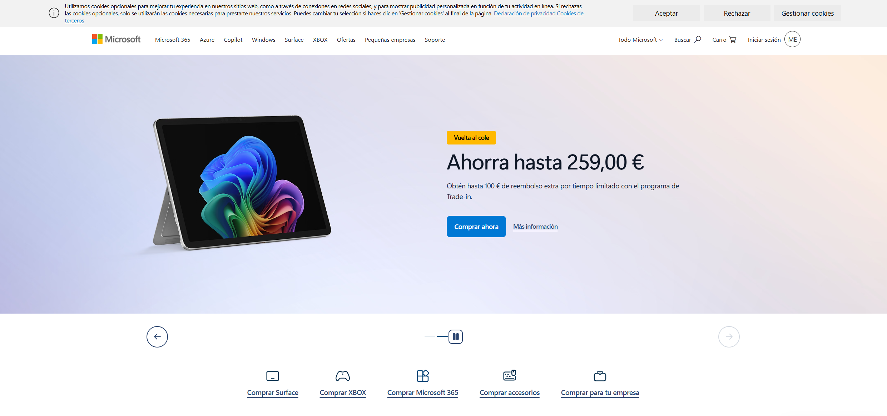

# GitHub, Microsoft y GitHub Copilot

## ¿Qué es GitHub?

**GitHub** es una plataforma utilizada para almacenar, gestionar y compartir proyectos de software. Está basada en **Git**, un sistema de control de versiones que permite guardar y controlar los cambios realizados en los archivos de un proyecto.

GitHub permite trabajar de forma individual o en equipo mediante repositorios.

Algunas de sus características principales son:

* **Repositorios**

  * Públicos
  * Privados
* Control de versiones
* Trabajo colaborativo
* Gestión de proyectos
* Revisión de código mediante *pull requests*

GitHub es utilizado por desarrolladores, empresas y estudiantes para organizar sus proyectos y colaborar con otras personas.

## ¿Qué empresa está detrás de GitHub?

La empresa propietaria de GitHub es **Microsoft**. Microsoft adquirió GitHub en 2018.

Microsoft es una de las principales empresas tecnológicas del mundo y desarrolla productos y servicios relacionados con sistemas operativos, software, videojuegos, servicios en la nube y herramientas para desarrolladores.

## ¿Qué es GitHub Copilot?

**GitHub Copilot** es un asistente de programación basado en inteligencia artificial. Ayuda a los desarrolladores a escribir y comprender código.

Entre sus funciones se encuentran:

* Sugerir código mientras se programa.
* Explicar código.
* Ayudar a encontrar y corregir errores.
* Proponer cambios en un proyecto.
* Responder preguntas relacionadas con el código.

Copilot puede utilizarse desde diferentes entornos de desarrollo, como Visual Studio Code.

## Relación entre GitHub y GitHub Copilot

GitHub y GitHub Copilot están relacionados porque ambos forman parte del ecosistema de herramientas para desarrolladores de GitHub.

GitHub permite almacenar y colaborar en proyectos, mientras que *Copilot* utiliza inteligencia artificial para ayudar durante el proceso de programación.

## Página oficial de Microsoft

A continuación se incluye una captura de pantalla de la página oficial de Microsoft:

